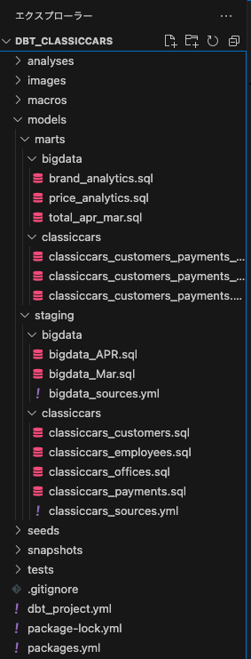
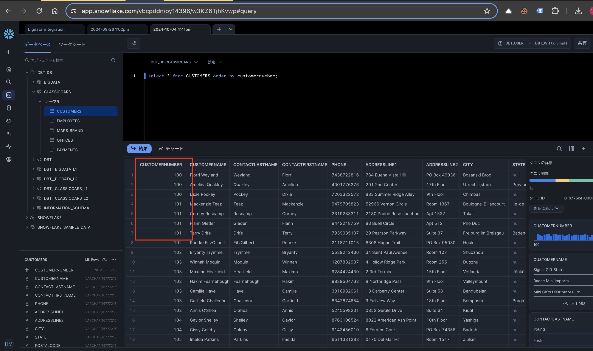
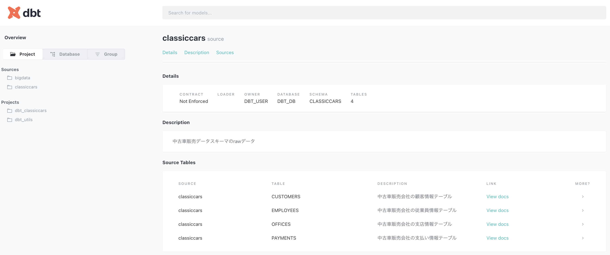

# プロジェクト概要
本プロジェクトはdbtの諸機能を検証するために作成した実機検証プロジェクトである  
今回はSnowflakeでの検証を行った

## 構成
dbtの特徴的な機能に関して下記構成に沿って検証した
1. dwhとの接続および権限設定
2. プロジェクトの構成
3. モデリング
4. テスト
5. ドキュメント
6. シード機能
7. スナップショット機能
8. dbt Packages
9.  【おまけ】dbt cloudとdbt coreの違い
10. 今回の検証で参考にしたドキュメント

## 1.dwhとの接続および権限設定
~編集中~

## 2.プロジェクトの構成
dbtから参照するDWH(Snowflake)のDB,SCHEMA,TABLE構成
```text:
   DBT_DB
   ├── BIGDATA
   │     ├── APR_2020
   │     └── MAR_2020
   └── CLASSICCARS
         ├── CUSTOMERS
         ├── EMPLOYEES
         ├── MAPS_BRAND(seedによりdbtから生成)
         ├── OFFICES
         └── PAYMENTS
```

dbtのプロジェクトは下記構成で開発を行う(初回build時に自動生成される)
```text:
   dbt_training
   ├── analysis
   ├── dbt_project.yml
   ├── docker-compose.yml
   ├── macros
   ├── models
   ├── seeds
   ├── snapshots
   ├── target
   └── tests
```


## 3.モデリング
dbtのデータモデリングを理解するために、階層構造を理解することが重要である   
* Sources(ソースデータ)：  
   TPC-Hデータセットであり、ソースYAMLファイルで定義される。
* ステージング層のモデル：  
   これらのモデルは、対応するソースと1対1の関係を持ち、名前を変更したり、キャストを変更したり、一般的にプロジェクトの残りの部分を通して一貫して使用される軽度の変換を実行するための場所として機能する。データ型の変換や
* マート層のモデル：  
   ビジネスプロセスやエンティティを表現するモデルで、ベースとなるデータソースから抽象化されている。ここで主要な変換を行う。  


【各ファイルの配置サンプル】  



<!-- ### 新規schemaの自動作成(改修中)
```sql:classiccars_offices.sql
   with source as (
      -- 新規schemaをソーステーブルが存在するDBへ新規作成したい場合は
      -- '{{ config(schema='marketing') }}'を記載する
      -- schema='xxx'で元schema名 + _xxxという新規schemaが作成される
      select * from {{ source('classiccars', 'OFFICES') }}
   ),
``` -->

## 4.テスト
テストによって品質の低いデータの混入を検知してアラートしたり、データの品質を保ったりするのに使います。  

### テストの種類
1. Singularテスト
   SELECT文のみ使用可能。存在してはいけないレコードをSELECT句で記述する。レコードの取得の成否を調べるクエリを用いる。  
   4月データの金額でマイナス価格の商品がないか確認する
   ```sql:sig_sample_test.sql
   select * from {{ source('bigdata', 'APR_2020') }}
   WHERE price < 0
   ```

2. Genericテスト(標準)
   dbt には始めから用意されている規定の Generic テストがあり、それを利用したテストを設定できます。
   * unique
      指定されたカラムのデータがすべてユニーク値であること
   * not_null
      指定されたカラムが null を含まないこと
   * accepted_values
      指定されたカラムには、指定された値以外を含まないこと
   * relationships
      指定されたカラムの値が、`to`に指定されたモデルの`field`に指定されたカラムに含まれていること  

   ymlファイルへの記載で設定が可能
   ```yml:classiccars_sources.yml
   version: 2
   sources:
   - name: classiccars
      description: 中古車販売データスキーマのrawデータ
      database: DBT_DB
      schema: CLASSICCARS
      tables:
         # 支店テーブルへの前処理を設定する
         - name: OFFICES
         description: 中古車販売会社の支店情報テーブル        
         columns:
            - name: OFFICECODE
               description: 支店番号
               # データテストを設定可能
               tests: 
               - unique
               - not_null
   ```  
   

   
3. Genericテスト(カスタム)
   標準のGenericテストでは不足する場合、自作のGenericテストを作成可能  
   ファイルの配置 : `test-path`の直下の`generic`ディレクトリ  
   sqlファイルへの記載で設定が可能
   ```sql:classiccars_sources.yml
   
      select *
      from {{ model }}
      where {{ column_name }} is null
   
   ```

   カスタムテストクエリを作成したら、テスト対象となるテーブル定義しているymlファイルで呼び出す
   ```yml:classiccars_sources.yml
   version: 2
   sources:
   - name: classiccars
      description: 中古車販売データスキーマのrawデータ
      database: DBT_DB
      schema: CLASSICCARS
      tables:
         # 支店テーブルへの前処理を設定する
         - name: OFFICES
         description: 中古車販売会社の支店情報テーブル        
         columns:
            - name: OFFICECODE
               description: 支店番号
               # データテストを設定可能
               tests: 
               - unique
               - my_not_null←これ

         - name: CUSTOMERS
         description: 中古車販売会社の顧客情報テーブル
         columns:
            - name: CUSTOMERNUMBER
               description: 顧客番号
               tests:
               - unique
               - my_not_null←これ
   ```

※補足  
`dbt debug`で接続テストも可能


## 5.ドキュメント
dbtのドキュメント機能を活用するため、以下のコマンドを実行し、ドキュメント用のファイルを生成する。
ドキュメント生成`dbt docs generate`  
ドキュメント表示用サーバ起動`dbt docs serve`  
**※dbt Cloud CLIまたはdbt Coredbt docs serveを使用してローカルで開発している場合は、 コマンドを使用します。dbt Cloud IDE はこのコマンドをサポートしていません。**  

cloud IDEを使用する場合は？
1. 「Dashbord」の「Setting」を開き、「Artifacts」のDocumentationからDeploy済みのJobを選択する
   
2. 「Documentation」を選択する
ブラウザで別タブが開きドキュメントが表示される
   

#### 静的ページとしての公開も可能
target配下にある３つのファイルを好きなサーバで公開することが可能  
↓対象ファイルと生成場所
```text:
   target
   ├── index.html
   ├── manifest.json
   └── catalog.json
```


## 6.シード機能
シードとは、dbtプロジェクト内のCSVファイルのことで、ほとんど変更のない小規模で静的なデータセットを用意・投入するケースに最適です。dbtでCSVファイルをシードとしてアップロードすることで、バージョン管理、テスト、ドキュメント作成など、他のモデルと同じベストプラクティスをCSVに適用することができます。例を挙げると、国コードのマッピングのリストや、特定のモデルから除外する従業員ユーザーIDのリストなどがあります。(ドキュメントより引用)

シードの更新はインクリメンタルモデルを使用します。  
**※インクリメンタルモデル : 差分更新モデル**  
`models/staging/bigdata/maps_brand_incremental.sql`を作成する。
```sql:maps_brand_incremental.sql
   {{
      config(
         materialized='incremental',
         -- unique_keyで設定したカラムを使用して
         -- 個々のレコードに更新がかかっているか確認する
         unique_key='brand_id'
      )
   }}

   with source as (

      select * from {{ ref('maps_brand') }}

   )

   select * from source

   

   -- this filter will only be applied on an incremental run
   where update_date > (select max(update_date) from {{ this }})

   
```

## 8.スナップショット機能
スナップショットはデータの復元機能のことです。   
SCD Type2 Dimensionという思想に従って、過去時点の状態の遷移を蓄積できるような仕組みです。   
簡単に言うと「データの変化があった行を UPDATE するのではなく、 INSERT で追記し、その行有効な時間を示す列を追加する」ことで実現しています。

`dbt snapshot`を実行すると下記カラムが自動生成されます。
* `dbt_updated_at`：行が最初にスナップショットに挿入された時のソースデータの更新日時。
* `dbt_valid_from`：行が最初にスナップショットに挿入された時の日時。
* `dbt_valid_to`：行が無効になった日時。スナップショット作成一回目はNULLになる。
* `dbt_scd_id`：スナップショットされたレコードに生成される一意なキー。


```sql:sample.sql
   

   {{
   config(
      target_database=[DB名]
      target_schema=[Schema名],
      unique_key=[主キー],
      strategy='timestamp',
      updated_at=[date型のカラム。ここに指定した列を最終更新日時として、既存テーブルと比較して更新された行をINSERTする],
   )
   }}

   select
      *
   from
      {{ source([Schema名], [テーブル名]) }}

   
```

## 9.


## 10.
**coreとcloudの大きな差分は「ジョブスケジューラの有無」**  
core : オーケストレーションツールが必要  
cloud : deploy機能でスケジューリング可能  

**その他の差分**  
1. クラウド統合開発環境(IDE)
2. 

## 12.その他
1. 3ヶ月1度バージョンアップが走る
2. 


## 11.今回の検証で参考にしたドキュメント
1. [dbt入門](https://zenn.dev/foursue/books/31456a86de5bb4/viewer/04bca4)  
   Zenn : 菱沼 雄太さん

2. [Accelerating Data Teams with Snowflake and dbt Cloud Hands On Lab](https://quickstarts.snowflake.com/guide/accelerating_data_teams_with_snowflake_and_dbt_cloud_hands_on_lab/index.html?index=..%2F..index#0)  
   Snowflake公式 QuickStart

3. [Snowflake & dbt Cloudハンズオン実践](https://dev.classmethod.jp/articles/snowflake-dbt-cloud-handson-challenge-vol2/)  
   classmethod

4. [dbtベストプラクティスを読む](https://zenn.dev/kyami/articles/4438f4d64185b4)  
   Zenn 著者 : kyamiさん

5. [dbt公式docs](https://docs.getdbt.com/)  
   dbt公式ドキュメント

6. [dbt Cloudにおけるプランの違いについて](https://dev.classmethod.jp/articles/differences-between-plans-in-dbt-cloud/)  
   classmethod

7. [dbt公式サイト](https://www.getdbt.com/pricing)  
   dbt公式サイト

8. [dbt Core & dbt Cloud: What’s the Difference?](https://cookjack248.medium.com/dbt-core-dbt-cloud-whats-the-difference-12993acc890a)  
   著者 : ??

9. [dbt Coreとdbt Cloudの関係性・違いなどについてまとめてみた](https://dev.classmethod.jp/articles/differences-between-dbt-core-and-dbt-cloud/)  
   clasmethod